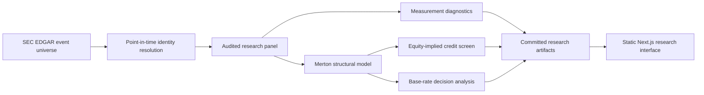

<p align="center">
  <picture>
    <source media="(prefers-color-scheme: dark)" srcset="frontend/public/brand/lockup-dark.svg">
    
  </picture>
</p>

<p align="center">
  <strong>Structural credit research under public-data constraints.</strong><br>
  A reproducible research system for measuring distress, testing what the record can support, and exposing what conventional credit datasets leave out.
</p>

<p align="center"><code>PHASE 0 | AUGUST 2026 | REPRODUCIBLE RELEASE</code></p>

<picture>
  <source media="(prefers-color-scheme: dark)" srcset="frontend/public/figures/hero-paths-dark.png">
  
</picture>

<p align="center"><sub>Structural model simulation: sigma 34%, mu 5%, horizon 3 years, barrier 56, seed 1974. The image is ambient model output, not observed issuer data.</sub></p>

> [!IMPORTANT]
> **149 of 346 sampled US bankruptcy candidates from 2010 to 2024, or 43.1%, can be resolved to a traded symbol from free public data.** Resolution rises from 6 of 47 (12.8%) in 2010 to 2011 to 46 of 67 (68.7%) in 2022 to 2024. The gradient is driven by disclosure infrastructure, not an economic change in default.

## Investment signal

Most credit models begin after a clean issuer universe already exists. This project asks the prior question: **which failed firms become observable enough to enter the model at all?**

That distinction matters because a research dataset can look complete while selecting issuers that are easier to identify, price, and model. The selection changes by disclosure era and issuer type. Any apparent distress signal inherits that measurement boundary before portfolio construction begins.

| Research terminal | Current evidence |
|---|---:|
| Bankruptcy candidates | 346 filings, 2010 to 2024 |
| Resolved to a traded symbol | 149 of 346 (43.1%) |
| Earliest disclosure era | 6 of 47 (12.8%) |
| Latest disclosure era | 46 of 67 (68.7%) |
| Near the large-firm rating boundary | 265 of 3,132 issuers (8.5%) |
| Published research modules | 6 completed modules |
| Empirical prediction claim | Not made before a matched control cohort exists |

This is a measurement finding before it is a modelling result. It changes how a credit researcher should interpret backtests, survivor comparisons, apparent coverage, and model confidence.

## Decision relevance

- **Private credit:** demonstrates the discipline required when prices are absent, borrower histories are sparse, and public comparables carry selection bias.
- **Distressed and special situations:** separates economic distress from the mechanics of finding the security that actually traded at the event date.
- **Asset management:** treats model output as a ranked decision aid, then tests how base rates and false positives affect portfolio usefulness.
- **Wealth and portfolio management:** makes assumptions, provenance, confidence, and downside interpretation visible before a signal reaches an allocation decision.
- **Private equity and energy underwriting:** provides a foundation for public-comparable volatility, leverage stress, covenant headroom, and recovery analysis without pretending that public equity is private debt.

## Research system

| Module | Investment question | Current artifact |
|---|---|---|
| **Model** | How far is enterprise value from the default barrier? | Client-side Merton solver with assumptions exposed |
| **Mispricing** | Where does equity-implied risk disagree with a periodic credit benchmark? | Directional screen against the January 2026 Damodaran synthetic-rating default-spread table |
| **Measurement** | Which defaults can the public record actually identify? | Full 346-candidate resolution audit with era, sector, size, and cell counts |
| **Discrimination** | When does a ranker become a useful alarm? | Interactive base-rate precision and false-positive exhibit |
| **Cases** | What do the model and data boundaries look like issuer by issuer? | Completed boundary case studies |
| **Data** | Can every published claim be traced and rebuilt? | Provenance, licensing policy, manifests, and downloadable derived artifacts |

Every published rate carries its numerator and denominator. Every figure keeps its title, number, and source line. No route requires a running API server.

## What makes the work defensible

1. **Point-in-time identity:** a current ticker is never accepted as proof that the same security traded at the bankruptcy date.
2. **Visible exclusions:** unreachable firms and model-inapplicable entities remain in the denominator and in the public audit.
3. **Conditioned comparisons:** era, sector, and size are reported together, with unstable cells withheld. One highlighted cell has 95% Wilson bounds from 60% to 91%, so the uncertainty stays visible.
4. **No circular benchmark:** the equity-implied screen is compared with a periodic synthetic-rating table, not with a value derived from the same model output.
5. **Deterministic publication:** generated assets and research figures are rebuilt and compared byte for byte before release.
6. **Explicit data rights:** raw third-party feeds are not committed or republished when their terms do not permit it.

## Research boundary

This is not an issuer-bond pricing system, a live trading signal, or an arbitrage claim. The January 2026 Damodaran input is a periodic analytical benchmark, not a contemporaneous bond quote, index observation, or issuer-specific spread.

The current release does not claim empirical model accuracy. That requires a pre-specified, point-in-time matched survivor cohort. The next evidence gate will report walk-forward discrimination with confidence intervals, precision at a realistic base rate, and an explicit false-positive cost.

Public disclosure also limits the study window. Pre-2011 filings often lack XBRL, and cover pages did not gain a structured trading-symbol field until 2019. The 2008 to 2009 default cluster is outside the reach of this free-public-data design.

## Research roadmap

The next releases deepen one credit thesis rather than adding unrelated breadth:

1. **Matched-control validation:** point-in-time survivor cohort, walk-forward evaluation, AUC with confidence intervals, precision, calibration, and false-positive cost.
2. **Investment committee memo:** one resolvable issuer with distance to default, implied spread, leverage, downside case, covenant decision, and out-of-sample outcome.
3. **Recovery and LGD:** recovery by claim class for a carefully documented bankruptcy subsample.
4. **Private-credit bridge:** public-comparable asset volatility translated into a private-borrower stress case and covenant headroom analysis.

## Data flow



```text
src/
  data/       identity resolution, source adapters, quota ledger, sample construction
  models/     Merton, synthetic rating, discrimination, event-study logic
scripts/      audits, deterministic assets, publication, release verification
data/
  processed/  committed derived research outputs
frontend/     Next.js research interface, built from committed data
docs/         methods, research decisions, audit notes, source policy
```

Generated site data carry source and commit provenance. A published figure must trace to a committed input or to a computation whose inputs and assumptions are shown.

## Reproduce the release

Requirements: Python 3.11 or later, Node 22 or later, and Chromium for asset verification.

```bash
python -m pip install -e ".[dev,assets]"
python -m playwright install chromium
cd frontend
npm ci
cd ..
```

Copy `.env.example` to `.env` and add only the credentials needed for a local research run. Credentials are never committed or exposed to the browser.

Run the complete release gate from the repository root:

```bash
python -m scripts.verify
```

The gate regenerates and compares public assets, reproduces published figures, lints and builds the frontend, runs the browser-level analytics check, then executes the supported Python tests. `make verify` delegates to the same command.

## Data governance

The public site commits derived research artifacts, not raw third-party feeds. SEC EDGAR provides event candidates, filing facts, and the point-in-time filer universe. Tiingo supports delisted-price research subject to its plan terms, and starter or trial raw responses are handled only in memory. FRED ICE BofA OAS was reviewed and excluded from public output because its series notes restrict publication of exact observations.

Read the [data-source and licensing policy](docs/DATA_SOURCES.md), the [resolution audit](docs/RESOLUTION_AUDIT.md), and the machine-readable [source registry](frontend/public/data/SOURCES.json).

## Selected references

- Merton, R. C. (1974). On the pricing of corporate debt: the risk structure of interest rates. *Journal of Finance* 29(2).
- Bharath, S. T. and Shumway, T. (2008). Forecasting default with the Merton distance to default model. *Review of Financial Studies* 21(3).
- Campbell, J. Y., Hilscher, J. and Szilagyi, J. (2008). In search of distress risk. *Journal of Finance* 63(6).
- Eom, Y. H., Helwege, J. and Huang, J.-Z. (2004). Structural models of corporate bond pricing: an empirical analysis. *Review of Financial Studies* 17(2).
- Huang, J.-Z. and Huang, M. (2012). How much of the corporate-treasury yield spread is due to credit risk? *Review of Asset Pricing Studies* 2(2).

<p align="center"><strong>Built as research that can survive the second question.</strong></p>
