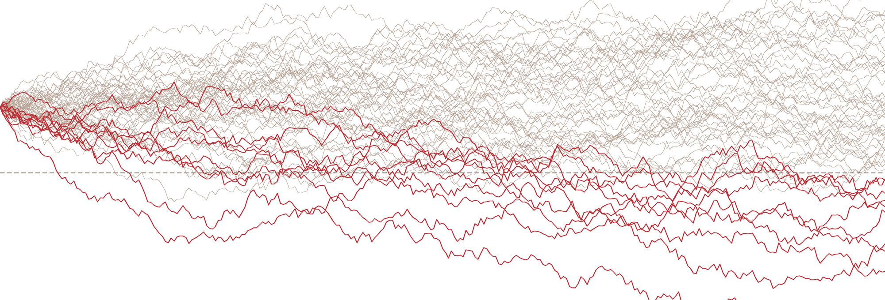
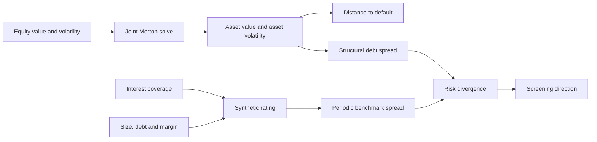

<p align="center">
  <picture>
    <source media="(prefers-color-scheme: dark)" srcset="frontend/public/brand/lockup-dark.svg">
    
  </picture>
</p>

<p align="center">
  <strong>Structural credit research, built to survive the second question.</strong><br>
  Live capital-structure analytics, independent risk benchmarks, explicit data rights, and a public correction trail.
</p>

<p align="center"><code>PHASE 0 // PUBLIC RELEASE // AUGUST 2026</code></p>

<picture>
  <source media="(prefers-color-scheme: dark)" srcset="frontend/public/figures/hero-paths-dark.png">
  
</picture>

<p align="center"><sub>Structural simulation: sigma 34%, mu 5%, horizon 3 years, barrier 56, seed 1974. Ambient model output, not observed issuer data.</sub></p>

> [!IMPORTANT]
> **Measurement study withdrawn, 24 August 2026.** Pre-publication review found that the bankruptcy collector advanced offsets by 10 while the SEC returned 100 results per response, then stopped after four requests. For 2016, 647 reported hits became 128 unique retrieved documents and 99 visible registrants before a 25-row selection. Results were relevance-ranked, not chronological, so the retained rows had no known inclusion probability. Every rate derived from that set is withdrawn. The route and public artifacts are withheld while the universe is rebuilt as a complete census. Results will be published whatever they show.

The approved [measurement-integrity census specification](docs/superpowers/specs/2026-08-24-measurement-integrity-census-design.md) defines the replacement population, operational case unit, point-in-time DERA rules, correction funnel and blinded verification.

## Investment terminal

The live release starts where an investment discussion starts: capital structure, independent evidence, decision cost and model boundary.

| Module | Investment question | Live artifact |
|---|---|---|
| **Model** | How far are firm assets from the debt barrier? | Two-equation Merton solver running entirely in the browser |
| **Mispricing** | Where do market-implied and accounting-implied risk disagree? | Structural debt spread against an independent January 2026 synthetic-rating benchmark |
| **Discrimination** | What does a credit alarm cost at a realistic base rate? | Interactive precision, false-positive and confusion-matrix exhibit |
| **Cases** | Where does the model stop being credible? | Clearly labelled illustrative boundary cases |
| **Data** | Can a reviewer trace every live claim and correction? | Sources, licensing, deterministic manifest and withdrawal record |
| **Measurement** | Which SEC registrant-cases can public data support? | **WITHDRAWN // CENSUS REBUILD ACTIVE** |

No route requires a running API server. Interactive model output is computed from visible inputs. Retained static evidence is generated from committed sources.

## The signal architecture

The project separates two views that are often allowed to contaminate each other.



The accounting benchmark has no path from model-implied asset value, asset volatility, distance to default or spread. Changing the Merton inputs cannot move the comparator. That independence is enforced in tests.

## What the live model does

Merton treats equity as a call option on firm assets. The browser solves the option equation and the equity-volatility relation jointly for unobserved asset value and asset volatility using nested bisection at a tolerance of `1e-8`.

From those values it reports:

- distance to default under the declared asset drift;
- a default-probability proxy from the declared distance to default;
- risky debt value under the structural model; and
- the structural debt spread implied by that debt value.

The Python research library also contains a separate PD-times-LGD expected-loss approximation. It is not the structural debt spread displayed by the site, and the two quantities must not be compared as if they were one formula.

## Why an investment professional should care

- **Private credit:** translates equity-market information into an asset-volatility and downside framework while stating where private-borrower data require comparable-company judgement.
- **Distressed and special situations:** makes identity, instrument applicability and event-time evidence explicit before a signal is trusted.
- **Asset management:** distinguishes a ranked analytical screen from an executable trade and exposes the base-rate cost of false positives.
- **Wealth and portfolio management:** shows how model uncertainty, source provenance and downside interpretation should be communicated before allocation.
- **Private equity and energy:** creates a foundation for comparable volatility, leverage stress, covenant headroom and recovery analysis without pretending public equity is private debt.

## Research correction as a feature

The withdrawn sample is not being repaired in place. The replacement design requires:

1. complete enumeration of SEC Item 1.03 search hits from 2010 through 2024;
2. an explicit 24-month registrant-case clustering convention with sensitivity checks;
3. a public-record coverage census with no size filter;
4. a strict 2012 onward investment subset using timely DERA total assets of at least USD 50 million;
5. a funnel from reported hits through final study eligibility;
6. event-time identity and price checks with no look-ahead; and
7. blinded verification with no blank verdicts.

The old artifacts remain recoverable in Git history and in clearly labelled correction documents. They are not copied into the deployed public directory.

## Repository map

```text
src/
  data/       SEC, DERA, identity, pricing and local budget controls
  models/     Merton, synthetic rating and discrimination logic
scripts/      deterministic generation, audits and release verification
data/
  processed/  derived research history, including withdrawn evidence
frontend/     static Next.js research terminal with Vercel Analytics
docs/         methods, decisions, correction records and census specification
tests/        numerical, provenance, publication and browser-level contracts
```

## Reproduce the public release

Requirements: [uv](https://docs.astral.sh/uv/), Python 3.11 or later, Node 22
or later, and Chromium. `uv.lock` is the research environment contract.

```bash
uv lock --check
uv sync --frozen --all-extras
uv run --frozen python -m playwright install chromium
cd frontend
npm ci
cd ..
uv run --frozen python -m scripts.build_site_data
uv run --frozen python -m scripts.verify
```

The release gate checks generated-asset and live-data drift, frontend lint, production build, production npm vulnerabilities, browser analytics integration and the supported Python suite.

Tiingo access fails closed until its credential's current-month unique-symbol
usage has been reconciled from the provider dashboard. Record that authoritative
starting count before any research fetch:

```bash
uv run --frozen python -m src.data.budget reconcile --used 123
```

The credential-associated ledger stays local and ignored. Only aggregate,
non-sensitive usage metadata may be committed.

## Data governance

The public site commits derived research artifacts, not raw third-party feeds. SEC EDGAR and DERA data are used with source hashes and point-in-time rules. Tiingo credentials and symbol-level usage history remain local and subject to plan terms. FRED ICE BofA OAS observations were excluded from public output after licensing review. The benchmark used on the live site is the January 2026 NYU Stern Damodaran synthetic-rating default-spread table, not an issuer bond quote or a live index.

Read the [source and licensing policy](docs/DATA_SOURCES.md), the [research decisions](docs/DECISIONS.md), and the machine-readable [source registry](frontend/public/data/SOURCES.json).

## Forward research sequence

1. Restore Measurement only after the census and blinded verification pass.
2. Build a point-in-time matched control cohort and walk-forward discrimination study.
3. Publish one investment-committee credit memo with a pass, watch or covenant decision.
4. Add recovery and LGD by claim class.
5. Bridge public-comparable asset volatility into a private-credit covenant stress case.

## Selected references

- Merton, R. C. (1974). On the pricing of corporate debt: the risk structure of interest rates. *Journal of Finance* 29(2).
- Bharath, S. T. and Shumway, T. (2008). Forecasting default with the Merton distance to default model. *Review of Financial Studies* 21(3).
- Campbell, J. Y., Hilscher, J. and Szilagyi, J. (2008). In search of distress risk. *Journal of Finance* 63(6).
- Eom, Y. H., Helwege, J. and Huang, J.-Z. (2004). Structural models of corporate bond pricing: an empirical analysis. *Review of Financial Studies* 17(2).
- Huang, J.-Z. and Huang, M. (2012). How much of the corporate-treasury yield spread is due to credit risk? *Review of Asset Pricing Studies* 2(2).

<p align="center"><strong>Research is credible when the correction mechanism is visible.</strong></p>
